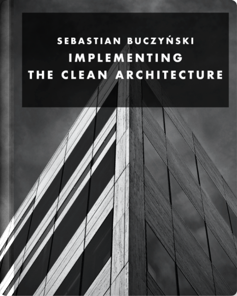
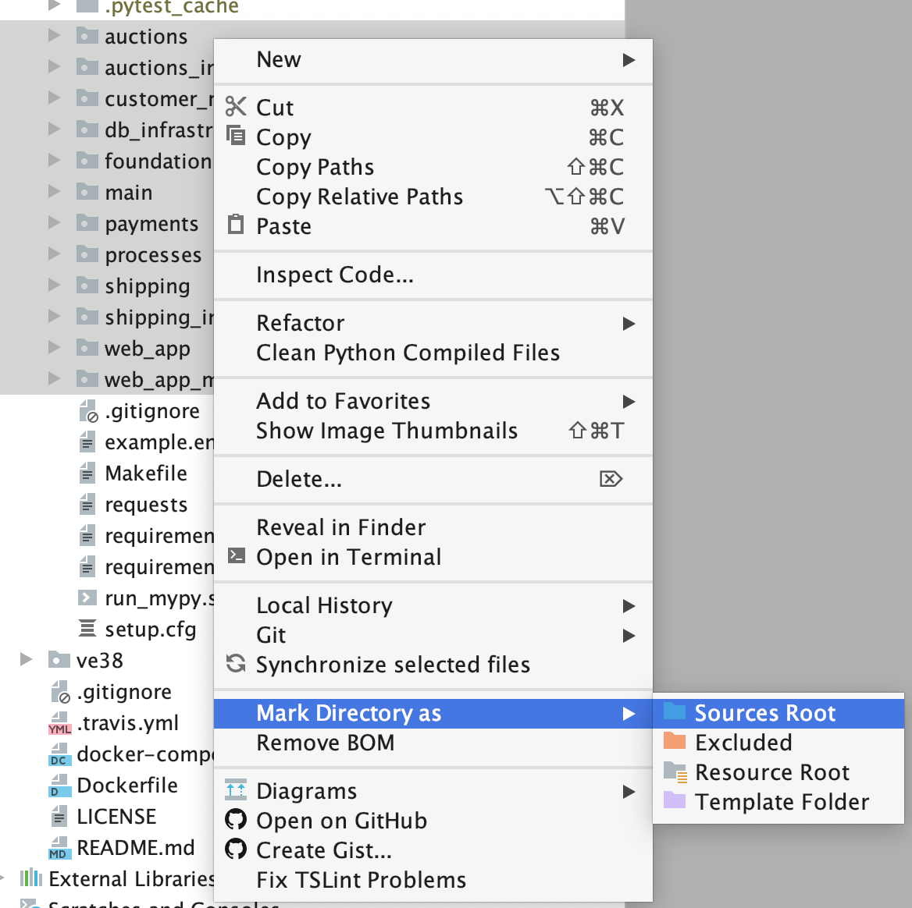

# Implementing the Clean Architecture - Auctions
Example project used in the book [Implementing the Clean Architecture](https://leanpub.com/implementing-the-clean-architecture)

[](https://leanpub.com/implementing-the-clean-architecture)

## Discord server

[](http://discord.gg/cDyDKv2VsY)

## Build status
[](https://app.circleci.com/pipelines/github/Enforcer/clean-architecture?branch=master) [](https://github.com/psf/black)

## Working with the repo
Pycharm - mark each package as Sources Root.

Console - `make dev` to install each subpackage in editable mode.

## Working with docker containers
```bash
# Start everything
docker-compose up --build

# Black formatting
docker-compose exec -T app black -l 120 ./
# isort
docker-compose exec -T app isort --recursive ./
# flake8 checks
docker-compose exec -T app flake8 --max-line-length 120 ./
```


